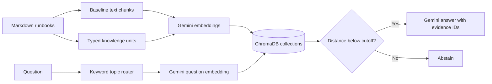

# Runbook RAG

An evidence-grounded assistant for operational runbooks. It indexes runbooks as both conventional text chunks and typed knowledge units, retrieves relevant evidence, and asks Gemini to answer with citations. If retrieved evidence is too distant, it abstains.

The source library currently covers monitoring, overload handling, incident response, SLOs and error budgets, and canary releases.

## What it demonstrates

- Runbook ingestion and vector indexing with ChromaDB
- Gemini embeddings and generation
- A baseline chunk index compared with typed knowledge units
- Deterministic, keyword-based topic routing and metadata filters
- A retrieval distance gate to reject weak matches
- Answers that cite knowledge-unit IDs

This project uses curated knowledge units for structured retrieval; it does **not** fine-tune the Gemini model.

## How it works



## Models and tools

- Python
- Google Gemini API: `gemini-embedding-2` and `gemini-3.5-flash-lite`
- ChromaDB for local vector storage
- `python-dotenv` for local API-key loading

## Quick start

### 1. Clone and install

```powershell
git clone https://github.com/iamprajjwalhere-cpu/runbook-rag.git
Set-Location runbook-rag
py -m venv .venv
.\.venv\Scripts\python.exe -m pip install -r requirements.txt
```

### 2. Configure the API key

```powershell
Copy-Item .env.example .env
```

Open `.env`, replace the placeholder with your Gemini API key, and save it. **Never commit `.env`**; it is excluded by `.gitignore`.

### 3. Build the local index

```powershell
.\.venv\Scripts\python.exe index_data.py
```

This creates the local `chroma_db/` directory with separate collections for baseline chunks and knowledge units. The database is ignored by Git and can be regenerated.

### 4. Ask a question

```powershell
.\.venv\Scripts\python.exe retrieve.py
```

Try: `What should we monitor when a service is overloaded?`

### 5. Evaluate retrieval

```powershell
.\.venv\Scripts\python.exe evaluate_retrieval.py
```

The evaluation embeds each labeled question once and compares the top three results from both collections.

### 6. Launch the web app

```powershell
.\.venv\Scripts\python.exe -m streamlit run app.py
```

## Current evaluation

On a hand-labeled set of 24 questions across the five runbooks, including paraphrases:

| Retrieval method | Hit@3 | MRR |
|---|---:|---:|
| Baseline chunks | 24/24 (100%) | 0.958 |
| Typed knowledge units | 24/24 (100%) | 0.958 |

The methods tie on this small dataset. The knowledge units add explicit topic, type, source, and stable ID metadata, but this evaluation does not yet show a ranking improvement. Hit@3 and MRR measure retrieval ranking, not answer correctness.

A manual out-of-scope check (“president of India?”) was rejected by the distance gate.

## Limitations

- The corpus contains five concise runbooks and 28 curated knowledge units.
- The evaluation set has 24 hand-labeled questions; results do not establish general retrieval accuracy.
- Topic routing uses keyword rules and falls back to unfiltered retrieval when no topic is detected.
- The `0.35` distance cutoff is a provisional setting for this corpus, not a universal confidence score.
- Generated answers are not yet covered by an automated answer-quality evaluation.

## Project layout

```text
data/
  runbooks/             Source Markdown runbooks
  knowledge_units.jsonl Curated, typed evidence records
  eval_questions.json   Labeled retrieval questions
app.py                  Streamlit interface
gemini_client.py        Gemini API client and model calls
ingest.py               Runbook loading and chunking
knowledge_units.py      Knowledge-unit parsing and validation
index_data.py           Embedding and ChromaDB indexing
retrieve.py             Topic routing, retrieval, abstention, and answers
evaluate_retrieval.py   Baseline-versus-KU retrieval comparison
```

## Sources

- [Google SRE Book: Monitoring Distributed Systems](https://sre.google/sre-book/monitoring-distributed-systems/)
- [Google SRE Book: Handling Overload](https://sre.google/sre-book/handling-overload/)
- [Google SRE Book: Managing Incidents](https://sre.google/sre-book/managing-incidents/)
- [Google SRE Workbook: Implementing SLOs](https://sre.google/workbook/implementing-slos/)
- [Google SRE Workbook: Example Error Budget Policy](https://sre.google/workbook/error-budget-policy/)
- [Google SRE Workbook: Canarying Releases](https://sre.google/workbook/canarying-releases/)
